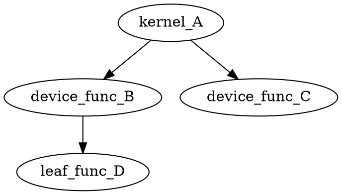

# Output Writing

The output phase is the final stage of nvlink's linking pipeline. After finalization has produced a self-consistent ELF wrapper with all sections ordered, symbols reindexed, and header fields written, the output phase serializes the in-memory ELF representation into bytes and delivers them to a destination -- a file on disk, a memory buffer, or (for Mercury/capmerc targets) an intermediate buffer that passes through the FNLZR post-link transform before reaching disk. Two secondary output modes also live in this phase: `--register-link-binaries` emits C macro definitions for CUDA runtime registration, and `--dot-file` writes a Graphviz callgraph.

The timing infrastructure brackets this work with `sub_4279C0("write")`. The phase runs unconditionally for every successful link invocation that produces an output ELF.

## Key Facts

| Property | Value |
|---|---|
| ELF-to-file entry | `sub_45C920` at `0x45C920` |
| ELF-to-memory entry | `sub_45C950` at `0x45C950` |
| Size computation | `sub_45C980` at `0x45C980` |
| Serialization engine | `sub_45BF00` at `0x45BF00` (13,258 bytes, 532 lines) |
| Polymorphic writer | `sub_45B6D0` at `0x45B6D0` |
| Program header emitter | `sub_45BAA0` at `0x45BAA0` (5,657 bytes, 228 lines) |
| Writer cleanup | `sub_45B6A0` at `0x45B6A0` |
| Callgraph DOT output | `sub_44CCF0` at `0x44CCF0` |
| FNLZR post-link | `sub_4275C0` at `0x4275C0` |
| Vector append helper | `sub_44FC10` at `0x44FC10` |
| Timing label | `"write"` |
| Called from | `main()` after finalization |
| CLI options | `-o` (output path), `--register-link-binaries`, `--dot-file` |

## Pipeline Position

```text
Finalization Phase (sub_445000)
  |
  v
FNLZR Pre-Link (sub_4275C0, Mercury pre-link on inputs)
  |
  v
*** Output Phase ***    <-- this page
  |
  |-- Direct path (non-Mercury):
  |     sub_45C920 -> sub_45BF00 -> sub_45B6D0 (fwrite)
  |
  |-- Mercury path (sm >= 100):
  |     sub_45C980 (compute size)
  |     sub_45C950 -> sub_45BF00 -> sub_45B6D0 (memcpy to buffer)
  |     sub_4275C0 (FNLZR post-link transform)
  |     fwrite(buffer, size, file)
  |
  |-- Register-link-binaries (--register-link-binaries):
  |     fprintf(file, "DEFINE_REGISTER_FUNC(%s)\n", ...)
  |
  |-- DOT callgraph (--dot-file):
  |     sub_44CCF0 -> fprintf("digraph callgraph { ... }")
  |
  v
Host Linker Script (--gen-host-linker-script, separate path)
```

## Output Dispatch in main()

The output decision tree in `main()` (starting around decompiled line 1447) selects one of two serialization paths depending on whether Mercury mode is active (`byte_2A5F222`, set when arch > sm\_99):

```c
if (error_flag)  ->  skip output entirely

fopen(output_filename, "wb")       // ::filename global
if (!file)  ->  fatal "cannot open output file"

if (byte_2A5F222) {                // Mercury mode
    size = sub_45C980(elfw);       // compute ELF byte count
    buffer = arena_alloc(0, size);
    sub_45C950(buffer, elfw);      // serialize to memory
    if (byte_2A5F29B)              // --extract debug mode
        write_extract_debug(buffer, size);
    sub_4275C0(&buffer, filename, arch, &out_size, 1);  // FNLZR post-link
    fwrite(buffer, 1, out_size, file);
} else {
    sub_45C920(file, elfw);        // direct serialize to FILE*
}
fclose(file);
```

The Mercury path must serialize to memory first because FNLZR (`sub_4275C0`) is an in-place binary rewriter -- it needs the complete ELF image in a contiguous buffer to rewrite instruction encodings, patch control-flow metadata, and produce the final SASS binary. The non-Mercury path writes directly to the file descriptor, avoiding the allocation of an intermediate buffer.

## The Polymorphic Writer: sub\_45B6D0

Every byte of the serialized ELF passes through `sub_45B6D0`, a polymorphic write dispatcher that supports five backend modes selected by an integer tag stored at offset `+0` of a 40-byte writer context object. The writer context is allocated by the path-specific constructors `sub_45B950` (file mode) and `sub_45BA30` (memory mode).

### Writer Context Layout

```c
struct elf_writer {           // 40 bytes total
    int32_t  mode;            // +0:  backend selector (0..4)
    int32_t  reserved;        // +4:  always 0
    void*    cleanup_state;   // +8:  state for cleanup callback (unused in practice)
    void*    rewind_fn;       // +16: rewind function pointer (set to &rewind for file mode)
    void*    cleanup_fn;      // +24: destructor callback (called by sub_45B6A0)
    void*    dest;            // +32: destination -- FILE*, buffer pointer, or callback context
};
```

### Mode Dispatch

```c
int64_t elf_write(elf_writer* w, void* data, size_t len) {
    if (w == NULL)                          // NULL writer -> stdout fallback
        return fwrite(data, 1, len, stdout);

    switch (w->mode) {
    case 0:  // Callback mode
        return w->callback(w->dest, data, len);

    case 1:  // No-op / size-counting mode
        return len;                         // consume bytes, write nothing

    case 2:  // Vector-backed growable buffer
        vector_append(w->dest, data, len);  // sub_44FC10
        return len;

    case 3:  // FILE* mode (primary output path)
        if (w->dest)
            return fwrite(data, 1, len, w->dest);
        // fallthrough: dest is NULL -> putc to stdout byte-by-byte
        for (i = 0; i < len; i++)
            _IO_putc(((uint8_t*)data)[i], stdout);
        return len;

    case 4:  // Direct memory copy (Mercury buffer path)
        memcpy(w->dest, data, len);
        w->dest += len;                     // advance write pointer
        return len;

    default:
        return -1;
    }
}
```

Mode 3 is constructed by `sub_45B950` (for `sub_45C920`). It opens the output FILE\* and stores a pointer to `rewind` as the rewind function. Mode 4 is constructed by `sub_45BA30` (for `sub_45C950`). It stores the base address of the pre-allocated buffer and advances `dest` as bytes are written.

Mode 2 uses a growable vector backed by arena-allocated chunks. The `sub_44FC10` (vector\_append) function manages this: each chunk is a 24-byte header (`capacity`, `remaining`, `data_ptr`) linked into a list. When the current chunk cannot hold the incoming write, a new chunk is allocated (sized to at least the vector's default chunk size or the write size, whichever is larger), the data is copied, and the chunk is appended to the list. The linker context's total byte count at offset `+8` of the vector is incremented after each write.

Mode 1 (no-op) is never explicitly constructed in the observed output paths but exists as a valid mode in the switch. It returns `len` without writing anything, so callers can replay the full serialization sequence against a mode-1 writer to obtain a byte count -- a dry-run sizer. In practice nothing exercises it: `sub_45C980` derives the size directly from precomputed ELF header fields rather than driving the serializer, so this mode survives only as latent infrastructure.

### Writer Cleanup: sub\_45B6A0

After serialization completes, `sub_45B6A0` is called on the writer context. It checks offset `+24` (the cleanup function pointer); if non-null, it calls that function with `w->dest` as the argument. Then it frees the writer context via `sub_431000` (arena deallocator). For mode 3, no cleanup function is registered (the FILE\* is managed externally by `main()`). For mode 4, no cleanup is needed since the buffer is arena-allocated.

## Serialization Order: sub\_45BF00

The core serialization function `sub_45BF00` performs a single linear pass through the ELF wrapper, emitting bytes in a strict order. Every write calls `sub_45B6D0` and checks the return value against the expected byte count; a mismatch triggers `sub_467460` with the error string `"writing file"`.

The function handles both ELF32 (class 1, `elfw+4 == 1`) and ELF64 (class 2, `elfw+4 == 2`). The ELF class determines structure sizes: ELF32 uses 52-byte headers, 40-byte section headers, and 32-byte program headers; ELF64 uses 64-byte headers, 64-byte section headers, and 56-byte program headers.

### Phase 1: ELF Header

```c
Write elfw (52 or 64 bytes)       // the ELF header (e_ident through e_shstrndx)
Write 1 byte of zero padding      // null terminator for alignment
```

The header size is determined by the class: 52 bytes for ELF32 (`v5 = 52, v4 = 53`), 64 bytes for ELF64 (`v5 = 64, v4 = 65`). The extra byte of padding (`v133[0] = 0`) is always written immediately after.

### Phase 2: Section Header String Table (.shstrtab)

```c
Write 1 byte null (index 0)       // SHN_UNDEF name
for i = 1..shstrtab_count:
    Write shstrtab[i] string + NUL terminator
    running_offset += strlen + 1
```

The section-header string table entries are stored in the ordered list at `elfw+336` (accessed via `elfw+312` for the count). Each entry is a null-terminated section name string. The loop writes each string including its terminator, tracking the running byte count in `v4`.

### Phase 3: Symbol String Table (.strtab)

```c
Write 1 byte null (index 0)       // empty string at strtab[0]
for j = 1..strtab_count:
    Write strtab[j] string + NUL terminator
    running_offset += strlen + 1
```

Identical structure to .shstrtab, sourced from `elfw+328` (count at `elfw+304`).

### Phase 4: Padding to Section Data

After both string tables, the function looks up section index 3 from the section list (`elfw+360`) via `sub_464DB0`. This section's file offset (at `sec+16` for ELF32 or `sec+24` for ELF64) determines how many zero-pad bytes must be emitted to reach the correct alignment:

```c
target_offset = section[3].sh_offset;    // from layout
pad_count = target_offset - running_offset;
if (pad_count < 0)
    fatal_error("Negative size encountered");
for (k = 0; k < pad_count; k++)
    write(0x00);                          // zero fill
```

### Phase 5: Symbol Table (.symtab)

The positive symbol array at `elfw+344` is serialized as the `.symtab` section content. Each entry is 24 bytes for ELF64 (`Elf64_Sym`) or 16 bytes for ELF32 (`Elf32_Sym`). The internal `SymbolRecord` layout is arranged so that its leading bytes already match the ELF-standard `Sym` on-disk format:

```c
sym_entry_size = (elf_class == 2) ? 24 : 16;
for (p = 0; p < sorted_array_count(elfw->pos_symbol_array); p++)  // elfw+344
    write(pos_symbol_array[p], sym_entry_size);
    running_offset += sym_entry_size;
```

### Phase 6: Section Data

The main serialization loop iterates sections 4 through `e_shnum - 1` (skipping the first 4 standard sections: null, shstrtab, strtab, symtab, which were already serialized inline). For each section:

1. **Alignment padding**: Compute gap between the current running offset and the section's `sh_offset`. If positive, emit `0x00` bytes one at a time through `sub_45B6D0`. If negative, fatal error `"Negative size encountered"`. The serializer never emits SASS NOP-sled fill or any non-zero pattern: code-section gaps are zero-filled identically to data-section gaps, and any in-stream NOPs that end up inside `.text*` must already be present in the fragment data produced by the merge / layout phases.

2. **NOBITS / empty check**: Sections of type `SHT_NOBITS` (8) or NVIDIA no-data types selected by the `is_nobits` bitmask (base `0x70000007`, mask `0x400D` -- `SHT_CUDA_GLOBAL`, `SHT_CUDA_LOCAL`, `SHT_CUDA_SHARED`, `SHT_CUDA_SHARED_RESERVED`; see [`is_nobits`](../elf/program-headers.md#first-pass-compute-segment-extents)) are skipped entirely -- no data bytes emitted, so they contribute to `sh_size` and (when in the code segment) to `p_memsz` but not to `p_filesz` or to the running file cursor. The same bitmask drives the segment-extent first pass in `sub_45BAA0`.

3. **Data fragment traversal**: For sections with data, the content is stored as a singly-linked list of 16-byte chunk cells rooted at `sec+72`. Each cell has:
   - `cell+0`: pointer to the next cell (NULL terminates the list)
   - `cell+8`: pointer to a 32-byte fragment descriptor
   - `descriptor+0`: data pointer (raw bytes handed to `sub_45B6D0`)
   - `descriptor+8`: in-section offset (compared against the running per-section cursor, *not* a file offset)
   - `descriptor+16`: reserved / unused by the writer
   - `descriptor+24`: fragment size in bytes

   The function walks this list, emitting inter-fragment padding when the fragment's offset exceeds the running position, then writing the fragment data:

   ```c
   cursor = 0;
   for (frag = section->frag_list; frag; frag = frag->next) {
       desc = frag->descriptor;
       if (desc->offset > cursor && desc->offset != (uint64_t)-1) {
           zero_pad(desc->offset - cursor);
           cursor = desc->offset;
       }
       write(desc->data, desc->size);
       cursor += desc->size;
   }
   ```

4. **Size validation**: After writing all fragments, the function checks that the total bytes written matches `sec->sh_size` (at `sec+20` for ELF32, `sec+32` for ELF64). On mismatch, it constructs a diagnostic string by concatenating the section name (`sec+96`) with `" section size mismatch"` and calls `sub_467460` to report the error. The concatenated string is `malloc`'d and `free`'d around the error call.

### Phase 7: Post-Section Padding

After all section data is emitted, the function checks whether the current offset has reached `e_shoff` (the section header table offset, stored at `elfw+32` for ELF32 or `elfw+40` for ELF64). If the running offset is less than `e_shoff`, zero-pad bytes fill the gap.

### Phase 8: Section Headers

The final loop writes the raw section header entries:

```c
shdr_size = (elf_class == 2) ? 64 : 40;
for (s = 0; s < e_shnum; s++) {
    shdr = list_get(elfw->sections, section_order[s]);
    write(shdr, shdr_size);
}
```

The section order array at `elfw+368` maps logical section indices to their position in the ordered section list at `elfw+360`.

### Phase 9: Program Header Table (sub\_45BAA0)

If the ELF type is `ET_EXEC` (value 2 at `elfw+16`) and certain flag conditions are met, `sub_45BAA0` is called to write a proper ELF program header table at the end of the file. This function constructs an array of `Elf_Phdr` entries on the stack (up to 4 segments):

1. **PT\_LOAD segment for section headers**: Always present. Covers the section header table region. File offset = `e_shoff`, file size = memory size = `e_shnum * shdr_size`, alignment = 8.

2. **PT\_LOAD segment for .strtab** (if `.strtab` base address is non-zero): Covers the string table region.

3. **PT\_LOAD segment for .shstrtab** (if `.shstrtab` base address is non-zero): Covers the section name string table. The segment's offset is computed relative to the `.shstrtab` base, and its file/memory size includes alignment-adjusted section data sizes accumulated by `sub_438BB0`.

4. **PT\_PHDR segment**: Self-referential segment pointing to the program header table itself. File offset = `e_shoff`, size = `e_phnum * phdr_size`.

The program header count field in the on-stack ELF header fragment (`e_phnum`) is set to 2, 3, or 4 depending on which optional segments are present. The entire phdr array is written via a single `sub_45B6D0` call.

The segment construction differs between ELF32 and ELF64: ELF32 phdrs are 32 bytes with 32-bit fields laid out as `{p_type, p_offset, p_vaddr, p_paddr, p_filesz, p_memsz, p_flags, p_align}`; ELF64 phdrs are 56 bytes with 64-bit offset/address/size fields and `p_flags` placed after `p_type`.

## Size Computation: sub\_45C980

`sub_45C980` computes the total byte count of the serialized ELF without actually writing anything. This is used by the Mercury path to pre-allocate the buffer before calling `sub_45C950`.

For ELF32:
```c
e_shnum = elfw->e_shnum;            // +48, uint16
if (e_shnum == 0)
    e_shnum = list_get(elfw->sections, 0)->sh_size;  // overflow encoding
result = elfw->e_shoff + e_shnum * elfw->e_shentsize;  // +32 + count * +46
if (elfw->e_type == ET_EXEC)
    result += 128;                   // space for program header table
```

For ELF64:
```c
e_shnum = elfw->e_shnum_64;         // +60, uint16
if (e_shnum == 0)
    e_shnum = list_get(elfw->sections, 0)->sh_size_64;
result = elfw->e_shoff_64 + e_shnum * elfw->e_shentsize_64;  // +40 + count * +58
flags = (elfw->e_ident[7] == 'A') ? (elfw->e_flags & 1) : (elfw->e_flags & 0x80000000);
if (elfw->e_type == ET_EXEC && !flags)
    result += 224;                   // space for 64-bit program header table
```

The 128 / 224 byte constants are the maximum space for 4 program header entries (4 x 32 = 128 for ELF32, 4 x 56 = 224 for ELF64).

## Mercury / Capmerc Path

For Mercury targets (sm >= 100, `byte_2A5F222` set), the output path takes a detour through the FNLZR post-link binary rewriter:

1. **Compute size**: `sub_45C980` calculates the exact byte count.
2. **Allocate buffer**: `sub_4307C0(0, size)` allocates from the global arena (arena index 0).
3. **Serialize to buffer**: `sub_45C950` writes the complete ELF into the buffer using writer mode 4 (direct memcpy with advancing pointer).
4. **Debug extract** (if `byte_2A5F29B`): When the `--extract` debug flag is set, the pre-FNLZR ELF is written to a side file. The filename suffix is chosen based on the target: `"cubin"` for sm < 100, `"sass.cubin"` for hardware-finalized SASS, `"capmerc.cubin"` for Mercury targets, or `"merc.cubin"` for the intermediate Mercury form.
5. **FNLZR transform**: `sub_4275C0(&buffer, filename, arch, &out_size, 1)` invokes the finalizer in post-link mode. The function:
   - Logs `"FNLZR: Post-Link Mode"` and `"FNLZR: Starting <filename>"` to stderr when verbose.
   - Validates that the Mercury executable flag is set in `e_flags`.
   - Constructs a 160-byte configuration structure on the stack with flags derived from `byte_2A5F222` (Mercury), `byte_2A5F225` (capmerc), `byte_2A5F310` (shared flag), `byte_2A5F210`, `byte_2A5F224`, `byte_2A5F223`.
   - Calls `sub_4748F0` -- the actual FNLZR engine entry point -- passing the configuration, the buffer, and the ELF wrapper.
   - On failure, emits a fatal error referencing the filename.
   - Logs `"FNLZR: Ending <filename>"` on success.
   - Returns the finalized buffer via the `out_size` output parameter.
   - Calls `sub_43D990` to release the original (pre-FNLZR) ELF wrapper.
6. **Write finalized**: `fwrite(buffer, 1, out_size, file)` writes the FNLZR-transformed binary to the output file.

The FNLZR transform rewrites SASS instruction encodings, control flow metadata, and scheduling information that can only be determined once the complete binary image is available. This is why Mercury targets require the serialize-then-transform-then-write sequence rather than direct file output.

## Register-Link-Binaries Output

When `--register-link-binaries <path>` is specified (`qword_2A5F2E0` is non-null), `main()` writes a C header file containing registration macros for the CUDA runtime. This runs after the ELF output, at approximately decompiled line 1624:

```c
FILE* f = fopen(register_link_binaries_path, "w");

// Count all linked objects plus additional modules
int total = list_count(object_list) + list_count(additional_modules);
fprintf(f, "#define NUM_PRELINKED_OBJECTS %d\n", total);

// Emit one macro per linked object
for (node = object_list; node; node = node->next)
    fprintf(f, "DEFINE_REGISTER_FUNC(%s)\n", node->data->name);

// Emit one macro per additional module
for (node = additional_modules; node; node = node->next)
    fprintf(f, "DEFINE_REGISTER_FUNC(%s)\n", node->name);

fclose(f);
```

The `DEFINE_REGISTER_FUNC` macro is expected to be defined by the including translation unit. It typically expands to a static constructor that calls `__cudaRegisterFatBinary` and `__cudaRegisterFunction` for each kernel in the named object. The `qword_2A5F1E0` list (additional modules) captures objects registered through the `-l` library mechanism that also need runtime registration.

Before writing, there is a special case: if the path already exists and a `_cuda_device_runtime_` substring is found in its contents, the file is deleted rather than overwritten. This handles the case where libcudadevrt was stripped from the link and its registration entry must be removed.

## DOT Callgraph Output: sub\_44CCF0

When `--dot-file <path>` is specified (`qword_2A5F2D0` is non-null), `main()` writes a Graphviz DOT file representing the device-side callgraph:

```c
FILE* f = fopen(dot_file_path, "w");
sub_44CCF0(f, linker_context);
fclose(f);
```

`sub_44CCF0` iterates the callgraph stored in the ordered list at `elfw+408`. For each entry (starting at index 1, since index 0 is the null sentinel), it resolves the function's symbol record via `sub_440590`, then walks the adjacency list at `entry+16` (a linked list of callee indices). For each edge, it emits a DOT edge line:



The function names come from the symbol record's name field at `sym+32`. The output is purely structural -- no attributes, weights, or subgraph clustering. The resulting file can be visualized with `dot -Tpng callgraph.dot -o callgraph.png`.

## Host Linker Script Output

A completely separate output path (controlled by `--gen-host-linker-script` / `-ghls`, stored in `dword_2A77DC0`) generates a linker script for the host linker rather than a device ELF. This path does not call any of the ELF serialization functions. Instead it writes a fixed linker script template:

```text
SECTIONS
{
    .nvFatBinSegment : { *(.nvFatBinSegment) }
    __nv_relfatbin : { *(__nv_relfatbin) }
    .nv_fatbin : { *(.nv_fatbin) }
}
```

Three modes exist, selected by `dword_2A77DC0`:

- **Mode 1**: Write the script directly to the output file, overwriting any existing content.
- **Mode 2**: Extract the host linker's default script via `ld --verbose`, strip the decorative lines with `sed '1,2d;$d'`, append the CUDA sections, then validate the combined script with `ld -T <script>`. This mode uses `sub_42FA70` (popen/system) to invoke the host toolchain.
- **Fallback**: If no output file is specified, write the script to stdout.

This output path is orthogonal to the device ELF output -- it is used when nvlink operates as a wrapper that generates input for the host linker rather than producing a device binary directly.

## Error Handling

All write operations check the return value of `sub_45B6D0` against the expected byte count. On mismatch, the function calls `sub_467460` with error context `&unk_2A5B990` and the message `"writing file"`. This error is fatal and terminates the linker.

Two additional error conditions exist in `sub_45BF00`:

1. **Negative size encountered**: If the gap between the current running offset and a section's target file offset is negative, the layout phase produced inconsistent offsets. This indicates a bug in the finalization/layout phases.

2. **Section size mismatch**: If the total bytes written for a section's data fragments does not match `sh_size`, the section's data was corrupted or incompletely populated during the merge/relocate phases. The error message includes the section name for diagnosis.

## Function Reference

| Address | Name | Role |
|---|---|---|
| `0x45C920` | `write_elf_to_file` | Top-level: create FILE\* writer, serialize, cleanup |
| `0x45C950` | `write_elf_to_memory` | Top-level: create memcpy writer, serialize, cleanup |
| `0x45C980` | `compute_elf_size` | Returns total serialized byte count without writing |
| `0x45BF00` | `serialize_elf` | Core serialization engine (header, strings, sections, phdrs) |
| `0x45B6D0` | `elf_write` | Polymorphic 5-mode write dispatcher |
| `0x45BAA0` | `write_program_headers` | Constructs and writes ELF program header table |
| `0x45B950` | `create_file_writer` | Allocates writer context for FILE\* output (mode 3) |
| `0x45BA30` | `create_memory_writer` | Allocates writer context for buffer output (mode 4) |
| `0x45B6A0` | `destroy_writer` | Calls cleanup function and frees writer context |
| `0x44FC10` | `vector_append` | Growable vector write for mode 2 |
| `0x44CCF0` | `callgraph_dump_dot` | Writes callgraph in Graphviz DOT format |
| `0x4275C0` | `fnlzr_post_link` | FNLZR post-link binary rewriter dispatch |
| `0x4748F0` | `fnlzr_engine` | FNLZR engine entry point (called by `sub_4275C0`) |
| `0x45CAC0` | `fatal_alloc_failure` | Trivial wrapper: fatal error on buffer allocation failure |
| `0x43DA80` | `compute_elf_extent` | Computes total byte extent of ELF image from headers |
| `0x462C10` | `path_decompose` | Splits path into directory and basename components |
| `0x462550` | `path_reassemble` | Reassembles path with new extension suffix |
| `0x43D990` | `release_elf_wrapper` | Frees pre-FNLZR ELF wrapper after transform |

## See Also

- [Pipeline Overview](overview.md) -- Phase 13 in the full pipeline sequence
- [Finalization Phase](finalize.md) -- the preceding phase that produces a serialization-ready ELF
- [Entry Point & Main](entry.md) -- `main()` orchestrating the Mercury vs non-Mercury output path
- [Mercury / FNLZR](../mercury/fnlzr.md) -- the FNLZR post-link binary rewriter for sm >= 100
- [Capsule Mercury Format](../mercury/capmerc-format.md) -- the output format produced by FNLZR
- [ELF Serialization](../elf/serialization.md) -- the ELF byte-level format written by `serialize_elf`
- [Device ELF Format](../elf/device-elf-format.md) -- `e_ident`, `e_type`, `e_machine` fields in the output header
- [Program Headers](../elf/program-headers.md) -- PHDR table written by `sub_45BAA0`
- [ELF Writer Structure](../structs/elf-writer.md) -- the `elfw` object consumed by serialization
- [Mode Dispatch](mode-dispatch.md) -- how mode 1/2 produces linker scripts instead of ELF
- [Dead Code Elimination](../linker/dead-code-elimination.md) -- callgraph used by `--dot-file` output

## Confidence Assessment

| Claim | Confidence | Evidence |
|-------|-----------|----------|
| `sub_45BF00` (serialize_elf), 13,258 B, 532 lines | **HIGH** | `stat -c%s` = 13,258; `wc -l` = 532 |
| `sub_45B6D0` (elf_write polymorphic writer), 5 modes | **HIGH** | Decompiled switch-case at `sub_45B6D0` shows exactly modes 0--4 with matching semantics |
| `sub_45BAA0` (program header emitter), 5,657 B, 228 lines | **HIGH** | `stat -c%s` = 5,657; `wc -l` = 228 |
| `sub_45C920` (write_elf_to_file) | **HIGH** | `decompiled/sub_45C920_0x45c920.c` exists |
| `sub_45C950` (write_elf_to_memory) | **HIGH** | `decompiled/sub_45C950_0x45c950.c` exists |
| `sub_45C980` (compute_elf_size) | **HIGH** | `decompiled/sub_45C980_0x45c980.c` exists (40 lines) |
| `sub_44CCF0` (callgraph_dump_dot) | **HIGH** | `decompiled/sub_44CCF0_0x44ccf0.c` exists |
| `sub_4275C0` (fnlzr_post_link), 3,989 B | **HIGH** | `stat -c%s` = 3,989 bytes |
| `"writing file"` error string | **HIGH** | String at `0x1d3b828` in `nvlink_strings.json` |
| `"Negative size encountered"` error string | **HIGH** | String at `0x1d3b84c` in `nvlink_strings.json` |
| `" section size mismatch"` error string | **HIGH** | String at `0x1d3b835` in `nvlink_strings.json` |
| `"digraph callgraph {"` DOT output | **HIGH** | String at `0x1d3ac2f` in `nvlink_strings.json` |
| `"DEFINE_REGISTER_FUNC(%s)"` macro output | **HIGH** | String at `0x1d34399` in `nvlink_strings.json` |
| `"FNLZR: Post-Link Mode"` verbose string | **HIGH** | String at `0x1d32397` in `nvlink_strings.json` |
| `"FNLZR: Starting %s"` verbose string | **HIGH** | String at `0x1d323ed` in `nvlink_strings.json` |
| `"FNLZR: Ending %s"` verbose string | **HIGH** | String at `0x1d32401` in `nvlink_strings.json` |
| `"in-memory-ELF-image"` buffer name | **HIGH** | String at `0x1d3236d` in `nvlink_strings.json` |
| `"_cuda_device_runtime_"` substring check | **HIGH** | String at `0x1d34383` in `nvlink_strings.json` |
| `"sass.cubin"` / `"capmerc.cubin"` suffix strings | **HIGH** | Strings at `0x1d33f9e` and `0x1d33fa9` in `nvlink_strings.json` |
| Host linker script `SECTIONS { .nvFatBinSegment ... }` | **HIGH** | Exact section block found at `0x1d34450` in `nvlink_strings.json` |
| `"ld --verbose"` for script generation | **HIGH** | String at `0x1d3415a` in `nvlink_strings.json` |
| `"collect2"` pipeline for flag extraction | **HIGH** | String at `0x1d343d8` with grep pipeline in `nvlink_strings.json` |
| Writer mode 3 = FILE*, mode 4 = memcpy | **HIGH** | Verified in `sub_45B6D0` decompiled code: case 3 calls `fwrite`, case 4 calls `memcpy` with advancing pointer |
| Writer mode 0 = callback, 1 = no-op, 2 = vector | **HIGH** | Case 0 uses indirect call, case 1 returns `a3` (size), case 2 calls `sub_44FC10` (vector_append) |
| Mercury path: compute size, serialize to buffer, FNLZR, fwrite | **HIGH** | Sequence visible in `main_0x409800.c`: `sub_45C980` -> `sub_45C950` -> `sub_4275C0` -> `fwrite` |
| Writer context layout (40 bytes) | **MEDIUM** | Inferred from field accesses at offsets +0, +8, +16, +24, +32 in `sub_45B6D0` and constructors |
| Size computation constants (128 / 224 bytes for phdr space) | **MEDIUM** | Values visible in `sub_45C980` decompiled code; interpretation as `4 * 32` and `4 * 56` is editorial |
| Serialization order (9 phases: header, shstrtab, strtab, padding, phdrs, sections, post-padding, shdrs, phdr table) | **MEDIUM** | Ordering matches decompiled control flow in `sub_45BF00`; phase boundaries are editorial grouping |
| `sub_4748F0` is the FNLZR engine entry point | **HIGH** | Called from `sub_4275C0` in decompiled code |
| All 21 function addresses in the function reference table | **HIGH** | All verified to exist in `decompiled/` directory |
