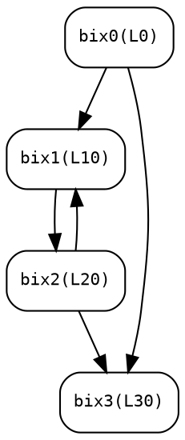

# Basic Blocks & Control Flow Graph

ptxas maintains a custom CFG infrastructure built entirely from scratch -- no LLVM `BasicBlock`, no LLVM `MachineBasicBlock`, no LLVM dominator framework. Basic blocks are stored in contiguous arrays, edges are stored in FNV-1a hash maps, and RPO / backedge / loop information is computed by dedicated functions in the `0xBDE000`--`0xBE2400` address range.

## Key Facts

| Property | Value |
|----------|-------|
| BasicBlock object size | 136 bytes (allocated by `sub_62BB00`) |
| Block info entry (scheduling) | 40 bytes per entry, contiguous array |
| Block naming | `bix%d` (block index, 0-based integer) |
| Edge representation | FNV-1a hash map (key = block index, value = successor list) |
| RPO storage | `int[]` array, indexed by RPO position |
| Backedge storage | Separate FNV-1a hash map |
| CFG construction phase | Phase 3: `AnalyzeControlFlow` |
| Block layout phase | Phase 112: `PlaceBlocksInSourceOrder` |
| BB merge suppression | `--dont-merge-basicblocks` / `-no-bb-merge` CLI flag |

## Two-Level Block Representation

ptxas uses two distinct but linked representations for basic blocks. The first is owned by the Code Object (used by all optimization passes); the second is owned by the scheduling/CFG analysis context (used by scheduling and post-regalloc passes).

### Code Object Block Array

The Code Object stores an array of pointers to full BasicBlock objects:

| Code Object Offset | Type | Field | Description |
|---------------------|------|-------|-------------|
| +296 | `ptr` | `bb_array` | Array of `BasicBlock*` pointers (8 bytes each) |
| +304 | `i32` | `bb_count` | Number of basic blocks |

Access pattern (from `sub_78B430`):

```c
int bb_count = *(int*)(ctx + 304);
for (int i = 0; i <= bb_count; i++) {
    BasicBlock* bb = *(BasicBlock**)(*(ctx + 296) + 8 * i);
    int rpo = *(int*)(bb + 144);
    // ...
}
```

### Scheduling Block Info Array

The scheduling context maintains a parallel 40-byte-per-entry array:

| Scheduling Context Offset | Type | Field | Description |
|---------------------------|------|-------|-------------|
| +976 | `ptr` | `block_info` | Contiguous array of 40-byte entries |
| +984 | `i32` | `num_blocks` | Max block index (0-based; actual count = `num_blocks + 1`) |

#### Block Info Entry Layout (40 bytes)

| Offset | Type | Field | Description |
|--------|------|-------|-------------|
| +0 | `ptr` | `bb_ptr` | Pointer to the full BasicBlock object |
| +8 | `ptr` | `insn_head` | Pointer to the instruction list head (or sentinel) |
| +16 | `u64` | `reserved` | Reserved / padding |
| +24 | `u32` | `flags` | Block flags |
| +28 | `i32` | `bix` | Block index (unique ID used in all CFG operations) |
| +32 | `u64` | `aux` | Auxiliary data (varies by pass) |

The DOT dumper at `sub_BE21D0` iterates this array with a 40-byte stride:

```c
for (int i = 0; i <= num_blocks; i++) {
    entry = *(sched_ctx + 976) + 40 * i;
    int bix = *(int*)(entry + 28);
    int label = *(int*)(*(ptr*)(entry + 0) + 152);
    printf("bix%d(L%x)", bix, label);
}
```

## BasicBlock Object (136 bytes)

Allocated by `sub_62BB00` during the parsing/lowering phase. The parser references the string `"bb-controlflow"` when constructing these objects. After allocation, the 136-byte block is zeroed via `memset`, then individual fields are populated.

### BasicBlock Field Map

| Offset | Type | Field | Description |
|--------|------|-------|-------------|
| +0 | `ptr` | `vtable` | Virtual function table pointer (or type tag) |
| +8 | `ptr` | `insn_list` | Instruction doubly-linked list head/sentinel |
| +16 | `ptr` | `insn_tail` | Instruction list tail (for O(1) append) |
| +24 | `u32` | `insn_count` | Number of instructions in the block |
| +28 | `u32` | `flags_a` | Block attribute flags (see below) |
| +104 | `ptr` | `bb_next` | Linked-list link to next BasicBlock in function |
| +108 | `u8` | `opcode_flags` | Terminator opcode classification bits |
| +128 | `ptr` | `succ_list` | Linked list of successor block references |
| +136 | `ptr` | `pred_list` | Linked list of predecessor block references |
| +144 | `i32` | `rpo_number` | Reverse post-order number (set by RPO computation) |
| +152 | `i32` | `label_id` | Label / source line identifier (displayed as `L%x` in DOT) |

The `insn_list` at +8 is the head of a doubly-linked list. Each instruction node has a `next` pointer at offset +8 of the instruction object. The sentinel/end is detected by comparing the current node pointer against the tail stored in the BasicBlock or against a per-block sentinel address.

### Successor/Predecessor Lists

Both `succ_list` (+128) and `pred_list` (+136) are singly-linked lists of small nodes. Each node contains:

| Offset | Type | Field |
|--------|------|-------|
| +0 | `ptr` | `next` pointer (NULL = end of list) |
| +8 | `i32` | Block index of the referenced block |

Iteration pattern (from `sub_78B430` -- LoopStructurePass):

```c
// Walk predecessor list
PredNode* pred = *(PredNode**)(bb + 136);
while (pred) {
    BasicBlock* pred_bb = *(BasicBlock**)(*(ctx + 296) + 8 * pred->bix);
    int pred_rpo = *(int*)(pred_bb + 144);
    // ...
    pred = pred->next;
}

// Walk successor list
SuccNode* succ = *(SuccNode**)(bb + 128);
while (succ) {
    BasicBlock* succ_bb = *(BasicBlock**)(*(ctx + 296) + 8 * succ->bix);
    // ...
    succ = succ->next;
}
```

## CFG Edge Hash Maps

In addition to the per-block predecessor/successor linked lists, the scheduling context maintains two global FNV-1a hash maps for fast edge queries. These are the primary edge representation used by RPO computation, backedge detection, and the scheduling pass.

### Successor Edge Map (Code Object +648)

Maps block index to a set of successor block indices. Used by `CFG::computeRPO` (`sub_BDE150`), `CFG::printEdges` (`sub_BDE8B0`), and `CFG::buildAndAnalyze` (`sub_BE0690`).

### Backedge Map (Code Object +680)

Maps block index to the set of backedge targets. A backedge exists when block `bix_src` has a successor `bix_dst` where `RPO(bix_dst) <= RPO(bix_src)` -- i.e., the successor was visited before the source in the DFS traversal, indicating a loop.

### FNV-1a Hash Parameters

All CFG hash lookups use identical parameters, confirmed across 50+ call sites:

| Parameter | Value |
|-----------|-------|
| Initial hash | `0x811C9DC5` |
| FNV prime | `16777619` (`0x01000193`) |
| Key size | 4 bytes (block index) |
| Hash method | Byte-by-byte XOR-fold |

The hash computation for a 32-bit block index `bix`:

```c
uint32_t hash = 0x811C9DC5;
hash = 16777619 * (hash ^ (bix & 0xFF));
hash = 16777619 * (hash ^ ((bix >> 8) & 0xFF));
hash = 16777619 * (hash ^ ((bix >> 16) & 0xFF));
hash = 16777619 * (hash ^ ((bix >> 24) & 0xFF));
uint32_t bucket = hash & (num_buckets - 1);
```

### Hash Map Structure

```
HashMap:
  +0   ptr   first_free_node    // Free list for node recycling
  +8   ptr   node_arena         // Pool allocator for new nodes
  +16  ptr   bucket_array       // Array of 24-byte bucket headers
  +24  u64   num_buckets        // Power of two, initial = 8
  +32  i32   total_elements     // Total entries across all buckets
  +36  i32   num_unique_keys    // Distinct keys inserted

Bucket (24 bytes):
  +0   ptr   head               // First node in collision chain
  +8   ptr   tail               // Last node in collision chain
  +16  i32   count              // Number of nodes in this bucket

Full Node (64 bytes, for edge maps):
  +0   ptr   next               // Chain link within bucket
  +8   i32   key                // Block index (bix)
  +12  i32   value_info         // Edge count or flags
  +16  ptr   value_array        // Pointer to sub-array of successor indices
  +24  i32   value_count        // Number of successors in sub-array
  +32  ptr   sub_hash_data      // Embedded sub-hash for multi-edge blocks
  +40  u64   sub_hash_size      // Sub-hash capacity
  +56  u32   cached_hash        // Cached FNV-1a hash of key

Simple Node (16 bytes, for backedge set membership):
  +0   ptr   next               // Chain link within bucket
  +8   i32   key                // Block index
  +12  u32   cached_hash        // Cached hash
```

Growth policy: rehash when `total_elements > num_unique_keys` (load factor > 1.0). New capacity = `4 * old_bucket_count`. Hash map insert/find is implemented at `sub_BDED20` (full nodes, 64 bytes) and `sub_BDF480` (simple nodes, 16 bytes).

## CFG Construction: Phase 3 (AnalyzeControlFlow)

`AnalyzeControlFlow` is phase 3 in the 159-phase optimizer pipeline. It runs immediately after the parser builds the initial instruction list and before any optimization. This phase:

1. **Populates the successor edge hash table** at Code Object +648 by scanning the last instruction of each basic block. Branch instructions (opcode 93 = `BRA`, opcode 95 = conditional/`EXIT`) provide the target block indices.
2. **Computes the backedge map** at Code Object +680 by identifying edges where the target has a lower or equal block index position in the DFS tree.
3. **Builds the reverse post-order (RPO) array** at Code Object +720 via iterative DFS.
4. **Identifies loop headers and backedges** for later loop optimization passes.

The phase is critical because the Bison parser constructs basic blocks and instruction lists incrementally. `AnalyzeControlFlow` ensures the CFG is fully consistent and annotated before optimization begins.

### Phase 6: SetControlFlowOpLastInBB

Phase 6 enforces a structural invariant: **control flow operations must be the last instruction in their basic block.** If a branch, jump, return, or exit instruction is followed by other instructions in the same block (which can happen during lowering passes), this phase splits the block at the control-flow instruction. New basic block entries are allocated and the instruction linked list is rewritten.

This invariant is required by all downstream passes -- the scheduler and register allocator assume that only the final instruction in a block can be a control-flow transfer.

## Reverse Post-Order (RPO) Computation

RPO is computed by `sub_BDE150` (`CFG::computeRPO`), a 9KB function that implements iterative DFS using an explicit stack.

### RPO Storage

| Code Object Offset | Type | Field |
|---------------------|------|-------|
| +720 | `ptr` | `rpo_array` -- `int*`, indexed by RPO position |
| +728 | `i32` | `rpo_size` -- number of entries used |
| +732 | `i32` | `rpo_capacity` -- allocated capacity |

The array is resized with the standard ptxas growth policy: `new_capacity = old + (old + 1) / 2`, with a minimum of `num_blocks + 1`. Growth is implemented in `sub_BDFB10`.

### Algorithm

The RPO computation uses a standard iterative DFS with post-order numbering:

```
function computeRPO(cfg, entry_block):
    stack = [entry_block]           // Explicit stack at offset +88..+100
    visited = new BitArray(num_blocks)  // At offset +16..+40
    in_stack = new BitArray(num_blocks) // At offset +40
    counter = num_blocks            // Decremented as blocks complete

    while stack is not empty:
        bix = stack.top()
        if visited[bix]:
            stack.pop()
            rpo_number[bix] = counter  // *(cfg+64)[bix] = counter
            rpo_array[counter] = bix   // *(*(cfg+720))[counter] = bix
            counter--
            continue

        visited[bix] = true
        for each successor s of bix (via hash map lookup):
            if not visited[s]:
                stack.push(s)

    return counter  // Should be -1 if all blocks reachable
```

The key assignment line from the decompilation:

```c
*(_DWORD *)(*(_QWORD *)(a1 + 64) + 4 * v16) = *a3;           // rpo_number[bix] = counter
*(_DWORD *)(*(_QWORD *)(*(_QWORD *)a1 + 720) + 4 * (*a3)--) = v16;  // rpo_array[counter--] = bix
```

After completion, `rpo_array[0]` is the entry block, and `rpo_array[num_blocks]` is the deepest post-dominator (typically the EXIT block).

### RPO Debug Dump

`sub_BDEA50` (`CFG::dumpRPOAndBackedges`) prints the RPO state:

```
Showing RPO state for each basic block:
    bix0 -> RPONum: 0
    bix1 -> RPONum: 1
    bix2 -> RPONum: 3
    bix3 -> RPONum: 2
RPO traversal order: [0, 1, 3, 2]
Showing backedge info:
    bix2 -> backedge's successor BB: 1
```

This output is gated by option flag #24 at offset `+1728` relative to the options manager.

## Backedge Detection and Loop Identification

Backedges are identified during `CFG::buildAndAnalyze` (`sub_BE0690`, 54KB). A backedge from block `src` to block `dst` exists when `dst` has already been visited in the DFS traversal (i.e., `dst` has a smaller or equal RPO number than `src`). Backedges are stored in the hash map at Code Object +680.

### Natural Loop Detection

The `LoopStructurePass` (`sub_78B430`) combines RPO numbering with backedge analysis to identify natural loops:

1. Calls `sub_781F80` (`BasicBlockAnalysis`) to compute RPO numbers and dominance.
2. Iterates the `bb_array` at Code Object +296.
3. For each block, checks if `rpo_number` (+144) is non-zero and equals the value at +152 (loop exit RPO marker). Combined with a branch opcode check (`opcode & 0xFFFFFFFD == 0x5D` = `BRA` or conditional branch), this identifies loop header blocks.
4. Walks the predecessor list to find the backedge source -- the predecessor with the largest RPO number that is still less than the header's RPO.
5. Walks the successor list to find the loop latch -- the successor with the smallest RPO number greater than the loop preheader's RPO.

The RPO range `[header_rpo, exit_rpo]` defines the set of blocks belonging to the loop body. A block with `header_rpo <= block_rpo <= exit_rpo` is inside the loop.

### LoopMakeSingleEntry Transformation

If a natural loop has multiple entry points, `sub_78B430` transforms it into a single-entry loop. This is gated by:

- The `LoopMakeSingleEntry` pass-disable check (via `sub_799250`)
- Knob 487 (queried via the knob vtable at +152)

Two code paths handle different branch types:
- **Opcode 93 (BRA):** Calls `sub_9253C0` to rewrite the branch target
- **Conditional branches:** Calls `sub_748BF0` to insert a new preheader block and redirect edges

After transformation, `sub_931920` is called to split blocks and update the instruction list.

## Dominance

Dominance is computed by `sub_BE2330` (4KB) and/or within `sub_781F80` (12KB, `BasicBlockAnalysis`). The implementation uses bitvector operations -- each block has a bitvector of dominators, and the fixpoint iteration proceeds in RPO order.

The bitvector layout used by the dominator computation:

| Offset | Type | Field |
|--------|------|-------|
| +0 | `ptr` | `data` -- pointer to `uint32_t[]` words |
| +8 | `i32` | `word_count` |
| +12 | `i32` | `capacity` |
| +16 | `i32` | `bit_count` |

Evidence for an iterative dataflow approach (rather than Lengauer-Tarjan) comes from the function sizes and patterns: `sub_781F80` at 12KB and `sub_BE2330` at 4KB are both small enough that they likely implement the simple iterative algorithm:

```
dom[entry] = {entry}
for all other blocks b: dom[b] = all_blocks

repeat until no changes:
    for each block b in RPO order (skip entry):
        dom[b] = {b} union (intersection of dom[p] for all predecessors p)
```

This is adequate for the small CFGs typical of GPU kernels (rarely exceeding a few hundred blocks). The O(n^2) worst case is not a concern at GPU kernel scale.

## Block Layout: Phase 112 (PlaceBlocksInSourceOrder)

Phase 112 (`PlaceBlocksInSourceOrder`) runs in the post-scheduling stage of the pipeline, after register allocation and before Mercury encoding. It reorders the basic block array to restore source-order layout.

The implementation at `sub_A92C50` (3.5KB binary, ~19KB decompiled) manipulates linked list structures and uses hash table lookups to reorder blocks. The goal is to minimize branch distances in the final SASS output -- placing fall-through successors immediately after their predecessors.

### Hot/Cold Block Layout

Two companion phases handle hot/cold partitioning:

| Phase | Name | Purpose |
|-------|------|---------|
| 108 | `OptimizeHotColdInLoop` | Moves cold blocks out of loop bodies |
| 109 | `OptimizeHotColdFlow` | Global hot/cold block separation |

Cold blocks (e.g., error handlers, unlikely branches, `assert` paths) are moved to the end of the function's block sequence. The `MarkAdditionalColdBlocks` pass marks blocks as cold based on heuristics. This separation improves instruction cache utilization on the GPU's SM instruction fetch unit.

### BB Merge Suppression

The `--dont-merge-basicblocks` (alias `-no-bb-merge`) CLI flag prevents the optimizer from merging consecutive basic blocks. This is used for debuggable code -- without it, the debugger cannot set breakpoints at the original source line boundaries. The flag is documented in the binary as:

> *"Normally, ptxas attempts to merge consecutive basic blocks as part of its optization process. However, for debuggable code this is very confusing. This option prevents basic block merging, at a slight perfomance cost."*

(Note: "optization" and "perfomance" are typos in the original binary string.)

## Entry and Exit Blocks

Block index 0 (`bix0`) is always the function entry block. It is the first element in the `bb_array` and the root of the RPO traversal. The entry block has no predecessors (its predecessor list at +136 is NULL).

The exit block is the block containing the `EXIT` instruction (opcode 95). For functions with multiple exit points, each `EXIT`-containing block is a CFG sink. The RPO computation assigns these the highest RPO numbers. The `SetControlFlowOpLastInBB` phase (phase 6) ensures each `EXIT` is the final instruction in its block.

The `CFG::buildAndAnalyze` function (`sub_BE0690`) checks the terminator opcode at instruction offset +28. Opcodes 4 and 7 (internal control-flow opcodes) receive special treatment during edge construction:

| Opcode | Type | Edge behavior |
|--------|------|---------------|
| 4 | Unconditional branch | Single successor edge to target block |
| 7 | Conditional branch | Two successor edges (taken + fall-through) |
| 93 | `BRA` | Unconditional branch (SASS-level) |
| 95 | `EXIT` / conditional | No successors (CFG sink) or conditional fall-through |

## CFG Update Protocol

Passes that modify the CFG (block splitting, merging, edge redirection) must maintain consistency across several data structures:

1. **Block array** -- both the Code Object `bb_array` (+296) and the scheduling `block_info` (+976) must be updated.
2. **Predecessor/successor linked lists** -- the per-block lists at +128 and +136 must reflect the new edges.
3. **Edge hash maps** -- the successor map (+648) and backedge map (+680) must be invalidated or updated.
4. **RPO array** -- the RPO order at +720 must be recomputed after structural changes.
5. **Block count** -- both `bb_count` (+304) and `num_blocks` (+984) must be incremented.

The general pattern observed in `sub_931920` (block splitter called from `sub_78B430`):

```
function splitBlock(ctx, bb, split_point):
    new_bb = allocateBasicBlock()
    
    // Move instructions after split_point to new_bb
    new_bb->insn_list = split_point->next
    bb->insn_list_tail = split_point
    split_point->next = sentinel
    
    // Transfer successors from bb to new_bb
    new_bb->succ_list = bb->succ_list
    bb->succ_list = new_node(new_bb->bix)
    
    // Update predecessor lists of old successors
    for each succ in new_bb->succ_list:
        replace bb in succ->pred_list with new_bb
    
    // new_bb's only predecessor is bb
    new_bb->pred_list = new_node(bb->bix)
    
    // Invalidate and recompute RPO
    ctx->bb_count++
    recomputeRPO(ctx)
```

The `AnalyzeControlFlow` phase (phase 3) is explicitly re-run or incrementally updated after phases that modify the CFG structure. The phase pipeline contains multiple `OriPerformLiveDead` and `GeneralOptimize` passes that may rebuild portions of the CFG.

## Key CFG Functions

| Address | Size | Identity | Confidence |
|---------|------|----------|------------|
| `sub_62BB00` | 16.5KB | `BasicBlock::allocate` -- allocates 136-byte block, initializes fields | HIGH |
| `sub_781F80` | 12KB | `BasicBlockAnalysis` -- RPO, loop detection, dominance | MEDIUM |
| `sub_78B430` | 1.2KB | `LoopStructurePass` -- single-entry loop transformation | HIGH |
| `sub_BDE150` | 9KB | `CFG::computeRPO` -- iterative DFS with explicit stack | HIGH |
| `sub_BDE6C0` | 3KB | `HashMap::erase` -- remove node from edge hash map | MEDIUM |
| `sub_BDE8B0` | 2KB | `CFG::printEdges` -- prints `"bix%d -> bix%d\n"` | HIGH |
| `sub_BDEA50` | 4KB | `CFG::dumpRPOAndBackedges` -- RPO + backedge debug dump | HIGH |
| `sub_BDED20` | 12KB | `HashMap::insertOrFind` -- full 64-byte node insert | HIGH |
| `sub_BDF480` | 10KB | `HashMap::insertOrFind_simple` -- 16-byte node insert | HIGH |
| `sub_BDFB10` | 24KB | `CFG::buildBlockMap` -- block array init, RPO resize | MEDIUM |
| `sub_BE0690` | 54KB | `CFG::buildAndAnalyze` -- master CFG builder | HIGH |
| `sub_BE21D0` | 1.4KB | `CFG::dumpDOT` -- Graphviz DOT format output | HIGH |
| `sub_BE2330` | 4KB | `CFG::computeDominators` -- bitvector-based dominance | MEDIUM |
| `sub_A92C50` | 3.5KB | `PlaceBlocksInSourceOrder` -- block reordering (phase 112) | MEDIUM |

## CFG Visualization

The `CFG::dumpDOT` function (`sub_BE21D0`) generates Graphviz DOT output when option flag #20 is enabled (offset +1440 from the options manager). The output format:



Where `L%x` is the label identifier at BasicBlock +152. This can be converted to a visual graph with `dot -Tpng`.

If option flag #24 is also enabled (offset +1728), the RPO and backedge dump from `sub_BDEA50` is appended.

## Related Pages

- [Ori IR Overview](./overview.md) -- Code Object layout, instruction format, register files
- [Instructions](./instructions.md) -- instruction format and opcode details
- [Data Structures](./data-structures.md) -- FNV-1a hash maps, bitvectors, linked lists
- [Optimizer Pipeline](../pipeline/optimizer.md) -- the 159-phase pipeline including CFG phases
- [Branch & Switch Optimization](../passes/branch-switch.md) -- OriBranchOpt pass
- [Loop Optimization](../passes/loop-passes.md) -- OriLoopSimplification, LoopUnrolling
- [Hot/Cold Partitioning](../passes/hot-cold.md) -- OptimizeHotColdFlow, MarkAdditionalColdBlocks
